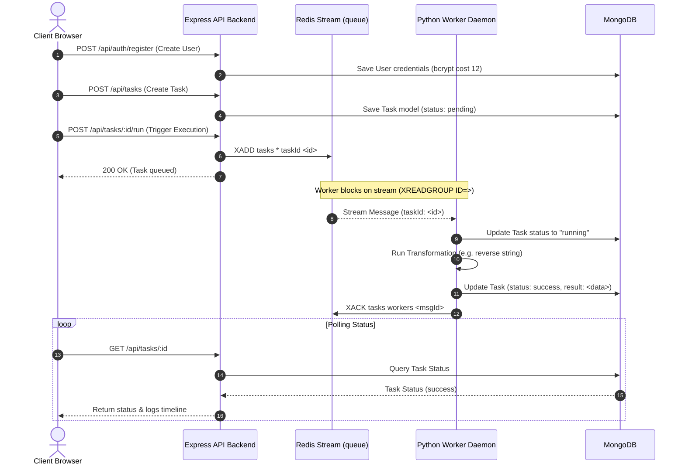

# Application Architecture: Antigravity Task Platform

This document describes the technical architecture, design decisions, data flow, scaling mechanics, and failure recovery loops implemented in the Antigravity Task Platform.

---

## 1. System Topology & Data Flow

The application is built on a decoupled, asynchronous, event-driven pattern designed to separate user-facing API interactions from heavy string transformation workloads.



---

## 2. Database Index Optimization

To support high performance for active users on the Dashboard, the MongoDB Task schema defines a compound index:

```javascript
TaskSchema.index({ userId: 1, createdAt: -1 });
```

### Why this is critical:
- **Equality & Sort Rule**: The primary query pattern on the Dashboard is retrieving the current authenticated user's tasks sorted chronologically (newest first):
  `Task.find({ userId }).sort({ createdAt: -1 })`.
- **Query Coverage**: Without this compound index, MongoDB would perform a full collection scan (`COLLSCAN`) filtering by `userId`, and then execute an expensive in-memory sort operation.
- **Performance**: With `{ userId: 1, createdAt: -1 }`, MongoDB uses a covered index scan (`IXSCAN`), yielding `O(1)` sorted fetches, eliminating CPU-heavy sorting, and scaling efficiently to millions of task records.

---

## 3. Event-Driven Messaging via Redis Streams

Rather than utilizing traditional Redis List polling (`BLPOP`) or Pub/Sub, the platform implements **Redis Streams** as its message queue.

### Core Advantages:
1. **Consumer Groups & Offsets**: Multiple worker instances can connect under the same consumer group (`workers`). Redis automatically distributes messages across active consumers, ensuring each message is processed by exactly one worker.
2. **Pending Entries List (PEL)**: When a worker reads a message via `XREADGROUP`, the message is not deleted. Instead, it transitions to a `pending` state and is recorded in the consumer group's PEL alongside the consumer's name and an idle timestamp.
3. **Explicit Acknowledgement (`XACK`)**: Only when a worker successfully completes the task operation and updates MongoDB does it issue `XACK`. If the worker crashes mid-job, the message remains safely in the PEL, preventing message loss.

---

## 4. Scaling Architecture: HPA vs KEDA

In a production Kubernetes environment, scaling queue consumer pods efficiently is a major architectural consideration.

| Attribute | Standard Kubernetes HPA | KEDA (Kubernetes Event-driven Autoscaling) |
|---|---|---|
| **Trigger Metric** | Resource-based (CPU / Memory consumption). | Event-based (Length/Pending message count of the Redis Stream). |
| **Scaling latency** | **High**: Consumers must run hot, consume CPU, and hit thresholds before a scale-out is triggered. | **Low**: Pods scale instantly as soon as messages accumulate in the stream, before CPU load spikes. |
| **Scale to Zero** | **No**: HPA requires at least 1 replica running at all times to monitor metrics. | **Yes**: Can scale deployment replicas down to `0` when the stream is empty, saving cloud compute costs. |
| **Autoscaling Suitability** | Better for synchronous web servers handling CPU-bound request spikes. | **Best** for asynchronous, event-driven worker daemons reading from queues or streams. |

*Recommendation*: In production deployments, **KEDA** is the preferred autoscale mechanism for the `worker` deployment, using the `redis-sentinel` or `redis` stream scaler.

---

## 5. Failure Recovery & Resiliency

The platform guarantees **at-least-once processing** through dual-layered recovery loops:

### A. Worker-Side Retries with Exponential Backoff
- If task processing throws an exception (e.g. transient database failure), the worker **does not** acknowledge (`XACK`) the stream message.
- The worker increments the task's `retryCount` in MongoDB.
- It sleeps for `2 ^ retryCount` seconds (exponential backoff) before yielding the thread to allow transient errors to resolve.
- If it fails 3 times, the task is marked as `failed`, the error stack trace is logged to the Task logs timeline, and the stream message is acknowledged (`XACK`) to prevent infinite looping.

### B. Background Reclaim Loop (Orphaned Tasks)
- If a worker container crashes hard or is killed mid-job, the task remains stuck in the `running` state in MongoDB, and its message remains in the Redis PEL.
- Every worker running in the cluster runs a background thread executing a reclaim loop.
- It scans the group's pending list using `XPENDING`. If a message has been pending/undelivered to a consumer for more than **60 seconds**, the loop calls `XCLAIM` to reclaim ownership to itself.
- Reclaimed messages are read by the main thread (querying ID `0` on startup/in the loop) and completed successfully, ensuring no job is orphaned indefinitely.
