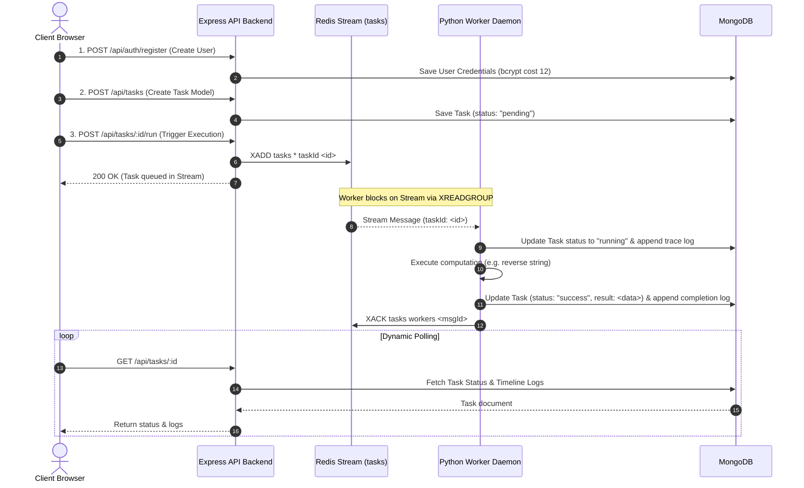

# AI Task Processing Platform - Architecture & System Design

This document details the system architecture, design decisions, scaling mechanics, data resiliency, and deployment strategies for the AI Task Processing Platform.

---

## 1. System Topology & Data Flow

The application implements an event-driven, asynchronous architecture that decouples user-facing HTTP interactions from heavy CPU/IO processing workloads.



### Flow Walkthrough
1. **Authentication**: Users register and log in via the backend. Passwords are encrypted using `bcrypt` (work factor 12) and sessions are authenticated using stateless JSON Web Tokens (JWT).
2. **Task Creation**: Authenticated users define tasks with a title, input payload, and operation. This creates a metadata record in MongoDB with a `pending` status.
3. **Task Queueing**: Triggering a run appends the task ID to a Redis Stream (`tasks`) via `XADD`. The user receives an immediate `200 OK` acknowledgment.
4. **Asynchronous Execution**: Python worker daemons belong to a Redis Consumer Group (`workers`). They block-read from the stream using `XREADGROUP`. Once a message is consumed, the task transitions to `running`.
5. **Trace Logs & Outputs**: The worker writes audit/error logs directly to the MongoDB task document's `logs` sub-document array. Upon successful calculation, the final result is written, the status transitions to `success` (or `failed` if retries expire), and the worker issues an `XACK` to Redis.

---

## 2. Database Index Optimization

To maintain rapid responses on the user dashboard under high task volumes, the MongoDB Task schema utilizes a compound index:

```javascript
TaskSchema.index({ userId: 1, createdAt: -1 });
```

### Indexing Analysis & Covered Queries
- **Query Alignment**: The primary query pattern of the Dashboard is:
  `Task.find({ userId: req.user.id }).sort({ createdAt: -1 }).skip(skip).limit(limit)`
- **Avoiding In-Memory Sorts**: By ordering the index keys with `userId: 1` (equality check) and `createdAt: -1` (sort check), MongoDB retrieves records in pre-sorted order. If the index did not have `createdAt: -1`, MongoDB would have to fetch the matching documents into RAM and perform an expensive in-memory sort (`blocking sort`), capping database throughput.
- **Index Scan Efficiency**: MongoDB executes a highly efficient Index Scan (`IXSCAN`) instead of a full Collection Scan (`COLLSCAN`). Because all sorting and filtering criteria are contained within the index, the query performance remains `O(log N)` even as the database grows to millions of documents.

---

## 3. Asynchronous Messaging via Redis Streams

Rather than using basic Redis Lists (`LPUSH/RPOP`) or Pub/Sub, this platform implements **Redis Streams** for task queuing.

### Resilience Features
1. **Consumer Groups**: Multiple worker instances share load. Redis coordinates message delivery, ensuring that each task is consumed by exactly one worker.
2. **Pending Entries List (PEL)**: When a worker consumes a task via `XREADGROUP`, the message is not deleted. It transitions to a pending state in the PEL.
3. **Explicit Acknowledgement (`XACK`)**: Only when the worker successfully saves the output to MongoDB does it send an `XACK` to remove the message from the stream.
4. **Orphan Reclaiming (`XCLAIM`)**: If a worker pod crashes mid-execution, the task remains stuck in `running` status and its message remains in the PEL. Active workers run a background thread that scans `XPENDING` every 30 seconds. If a message is stuck in the PEL for over 60 seconds, the worker claims ownership using `XCLAIM` and re-runs it, guaranteeing **at-least-once processing**.

---

## 4. Handling High Task Volumes (100,000 Tasks/Day)

To scale the architecture to support a consistent workload of **100,000 tasks/day**, we must evaluate the network, compute, database, and storage capacity requirements.

### Throughput Calculations
- **Average Workload**: 
  $$\text{Average Throughput} = \frac{100,000 \text{ tasks}}{86,400 \text{ seconds}} \approx 1.16 \text{ tasks/sec (tps)}$$
- **Peak Workload (10x Spikes)**:
  $$\text{Peak Throughput} = 1.16 \text{ tps} \times 10 \approx 11.6 \text{ tps}$$
- **Worker Capacity**: 
  A single Python worker pod can process a simple string operation in approximately **10ms**. With Redis network latency included, one single-threaded worker can easily handle **40–50 tps**. 
  - To support peak load (11.6 tps), we need a minimum of 1 worker pod running.
  - To support failover and redundancy, we configure a minimum of **2 worker pods** in production.

### Storage Capacity Calculations
- **Average Document Size**: 1 KB (including logs, input payload, and output).
- **Daily Storage Expansion**:
  $$\text{Daily Growth} = 100,000 \text{ tasks} \times 1 \text{ KB} = 100,000 \text{ KB} \approx 100 \text{ MB/day}$$
- **Annual Storage Capacity**: 
  $$\text{Annual Growth} = 100 \text{ MB/day} \times 365 \text{ days} \approx 36.5 \text{ GB/year}$$
- **Data Retention & Archiving Policy**:
  To prevent MongoDB performance degradation over time, we enforce a **30-day retention policy**. A nightly background cron job runs a script to prune or archive tasks older than 30 days:
  ```javascript
  db.tasks.deleteMany({ createdAt: { $lt: new Date(Date.now() - 30 * 24 * 60 * 60 * 1000) } });
  ```
  This keeps active storage capped at approximately **3.0 GB**, maintaining maximum index performance.

---

## 5. Worker Scaling Strategy: HPA vs. KEDA

While standard Kubernetes Horizontal Pod Autoscalers (HPA) scale pods based on CPU and memory usage, this is suboptimal for asynchronous task workers.

| Metric / Scenario | Standard Kubernetes HPA | KEDA (Kubernetes Event-driven Autoscaling) |
|---|---|---|
| **Primary Metric** | Resource-based (CPU / Memory consumption). | Event-based (Queue length, Redis stream size). |
| **Response Latency** | **Slow**: Worker pods must run hot and consume resources before HPA registers the spike and schedules new pods. | **Instant**: KEDA checks the Redis stream length and scales out immediately as tasks queue up, preventing queue lag. |
| **Scale to Zero** | **Impossible**: HPA requires at least 1 pod running to report metrics to the metrics server. | **Supported**: KEDA can scale worker replicas to `0` when the queue is empty, saving significant cloud costs. |
| **Autoscaling Suitability** | Best for HTTP API web servers handling concurrent user requests. | **Best** for event-driven workers reading from queues/message streams. |

### Production Recommendation
In production, we implement **KEDA** utilizing the `redis-streams` trigger. When the number of pending/unacknowledged messages in the Redis Stream exceeds 5 per worker, KEDA automatically scales the worker deployment from `2` up to a maximum of `10` replicas.

---

## 6. Redis Failure Handling & Recovery Strategy

Redis holds the transient state of all tasks currently in progress. Its reliability is maintained through persistence configurations and high-availability topologies.

### A. Persistence Policy
To ensure that tasks are not lost in the event of a Redis container crash, we enable dual persistence:
1. **RDB (Redis Database Snapshots)**: Hourly snapshots to disk for point-in-time recovery.
2. **AOF (Append Only File)**: Every write operation is appended to a log file. We configure `appendfsync everysec` which guarantees that at most **1 second** of task messages can be lost during an abrupt host crash, while preserving high write performance.

### B. High Availability (HA) Topology
- **Staging**: A single standalone Redis pod with a persistent volume claim (PVC) mapping AOF files.
- **Production**: A **Redis Sentinel** deployment consisting of 1 Primary node and 2 Replica nodes spread across separate physical Kubernetes nodes. 
  - Sentinels continuously monitor the primary node. 
  - If the primary goes offline, the Sentinels initiate an election and promote a replica to primary within 5 seconds.
  - Active worker and backend clients connect to Sentinel nodes to resolve the active primary address automatically.

---

## 7. Deployment Strategy: Staging vs. Production

To maintain system integrity and ease of maintenance, we maintain distinct configurations for our environments managed entirely via Argo CD GitOps.

| Component / Setting | Staging Environment | Production Environment |
|---|---|---|
| **Cluster Topology** | Single-Node Cluster (k3s/k3d). | Multi-AZ Managed Kubernetes (EKS / GKE). |
| **Argo CD Sync** | **Automatic (Auto-Sync)**: Commits to the infra repository instantly sync and deploy changes. | **Manual Approval**: Commits are staged in Argo CD, requiring an operator to click "Sync" or pass GitOps checks. |
| **MongoDB Topology** | Standalone Pod with PVC. | 3-Node MongoDB Replica Set (with automatic leader election). |
| **Redis Topology** | Standalone Pod with AOF. | 3-Node Redis Sentinel (1 Primary, 2 Replicas). |
| **Worker Replicas** | Min: `1`, Max: `2` (HPA scales on 80% CPU). | Min: `2`, Max: `10` (KEDA scales on Redis stream length). |
| **Security / ingress** | HTTP only, local Traefik routing. | HTTPS (Cert-Manager + TLS), Cloudflare Web App Firewall. |
| **Resource Limits** | Restricted (conserves staging compute). | High Limits (guarantees guaranteed CPU/RAM resources). |

### GitOps Sync Workflow
1. A developer pushes code changes to the `main` branch of the Application Repository.
2. GitHub Actions runs lints and tests. Upon success, it builds docker images and pushes them to GHCR tagged with the Git commit SHA.
3. The GitHub Actions runner checks out the Infrastructure Repository and updates the image tags inside `manifests/services/*-deployment.yaml`.
4. **Staging Argo CD**: Automatically detects the commit in the infrastructure repository, pulls the new manifests, and performs a rolling upgrade.
5. **Production Argo CD**: Detects the change but waits in an `OutOfSync` status. The operations team reviews the change and triggers a manual sync, rolling out the new code to production with zero downtime.
